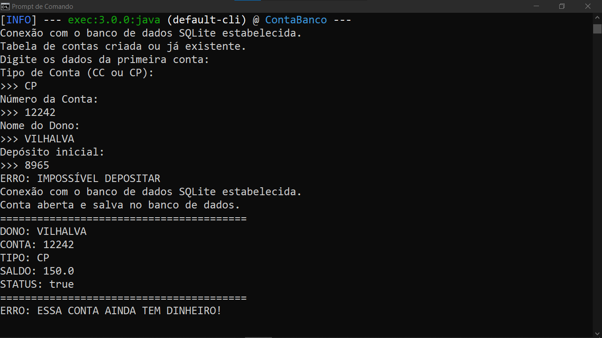
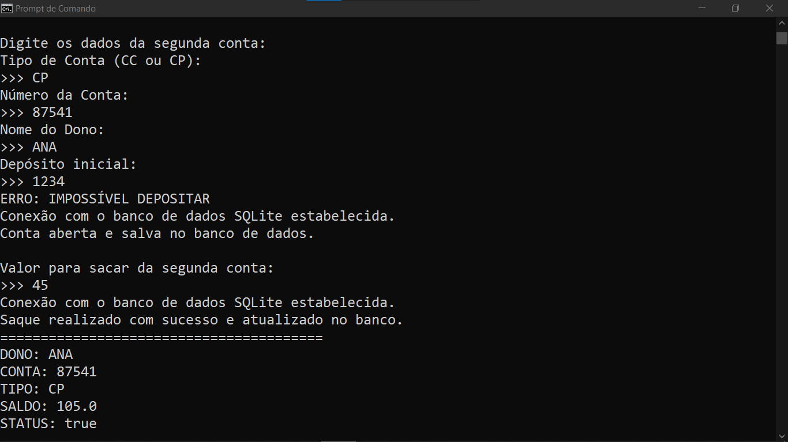
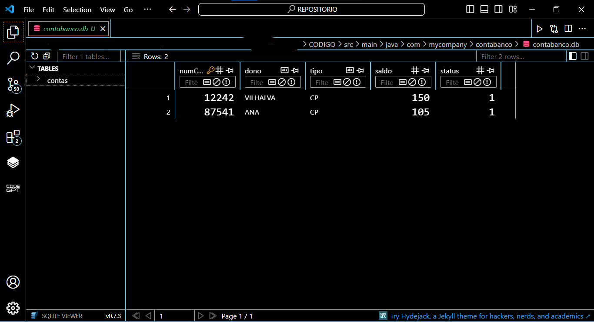

# CONTA DO BANCO COM SQLITE
👨‍🏫ESTE PROJETO É UMA EXCELENTE INTRODUÇÃO À PROGRAMAÇÃO ORIENTADA A OBJETOS EM JAVA, MANIPULAÇÃO DE BANCOS DE DADOS SQLITE E GERENCIAMENTO DE DADOS PERSISTENTES.

 <br>
 <br>
 <br>

## DESCRIÇÃO:
**ContaBanco** é um aplicativo simples desenvolvido em Java que simula a gestão de contas bancárias utilizando um banco de dados SQLite. O aplicativo permite a criação, manipulação e consulta de contas bancárias, oferecendo funcionalidades como abertura de conta, depósito, saque e fechamento de conta.

## FUNCIONALIDADES:
1. **Criar Conta**: O usuário pode abrir uma nova conta informando o tipo (Conta Corrente - CC ou Conta Poupança - CP), número da conta e nome do dono. O sistema aplica um depósito inicial baseado no tipo de conta:
   - Conta Corrente (CC): depósito inicial de R$50.
   - Conta Poupança (CP): depósito inicial de R$150.

2. **Depositar**: O usuário pode fazer depósitos em sua conta.

3. **Sacar**: O usuário pode realizar saques, desde que o saldo seja suficiente.

4. **Fechar Conta**: O usuário pode fechar a conta, desde que não haja saldo (ou seja, a conta deve estar zerada).

5. **Estado Atual**: O aplicativo exibe o estado atual da conta, incluindo informações como dono, número, tipo, saldo e status da conta.

6. **Persistência de Dados**: Todos os dados são armazenados em um banco de dados SQLite, permitindo que as informações persistam mesmo após o fechamento do aplicativo.

## EXECUTANDO O PROJETO:
1. **Certifique-se de que o projeto esteja compilado:**
   Antes de executar o projeto, você deve garantir que ele foi compilado corretamente. Navegue até o diretório `./CODIGO`, e use o seguinte comando para compilar:

   ```bash
   mvn clean install
   ```

2. **Executar o projeto:**
   Para executar a aplicação com o Maven, usando a classe principal definida no seu `pom.xml`, use o comando:

   ```bash
   mvn exec:java
   ```

3. **Interação com o Usuário**:
   - Siga as instruções no terminal para abrir contas, fazer depósitos, saques e fechar contas. Digite os dados solicitados quando solicitado.

4. **Verificar os Dados**:
   - Use um visualizador SQLite para abrir o arquivo `contabanco.db`, que deve estar localizado na pasta `./CODIGO/src/main/java/com/mycompany/contabanco/`. Você poderá visualizar as contas criadas e seus respectivos dados.

## NÃO SABE?
- Entendemos que para manipular arquivos em muitas linguagens e tecnologias relacionadas, é necessário possuir conhecimento nessas áreas. Para auxiliar nesse aprendizado, oferecemos alguns subsidios:
* [CURSO DE JAVA](https://github.com/VILHALVA/CURSO-DE-JAVA)
* [CURSO DE SQLITE](https://github.com/VILHALVA/CURSO-DE-SQLITE)
* [CONFIRA MAIS CURSOS](https://github.com/VILHALVA?tab=repositories&q=+topic:CURSO)

## CREDITOS:
- [PROJETO BASEADO NO "CONTA DO BANCO"](https://github.com/VILHALVA/CONTA-DO-BANCO)
- [PROJETO FEITO PELO VILHALVA](https://github.com/VILHALVA)


